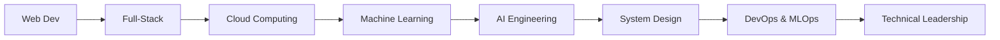

<div align="center">

# 🚀 Kazi Rohanuzzaman Mehal
### Microsoft Learn Student Ambassador | Full-Stack Developer | ML Engineer


</div>

---

<div align="center">

### 🌍 **Dhaka, Bangladesh** | 💻 **Innovating with Code** | 🎯 **Problem Solver**

[](https://github.com/MihalKazi)
[](https://www.linkedin.com/in/kazi-rohanuzzaman-mehal-43ba42268/)
[](https://www.facebook.com/mihal.kazi.1)
[](https://www.instagram.com/_vegeta_the_prince__)

</div>

---

## 🧠 About Me


```typescript
const mehal = {
    role: "Microsoft Learn Student Ambassador",
    location: "Dhaka, Bangladesh 🇧🇩",
    currentFocus: ["Full-Stack Development", "Machine Learning", "Cloud Computing"],
    technologies: {
        frontend: ["React", "Next.js", "TypeScript", "Tailwind CSS"],
        backend: ["Node.js", "Python", "C#", ".NET", "Express.js"],
        databases: ["MongoDB", "PostgreSQL", "MySQL", "Redis"],
        cloud: ["Azure", "AWS", "Docker", "Kubernetes"],
        ml: ["TensorFlow", "PyTorch", "Scikit-learn", "OpenCV"],
        tools: ["Git", "VS Code", "Figma", "Postman"]
    },
    currentlyLearning: "Generative AI & LLMs",
    funFact: "I debug with console.log() and I'm proud of it! 🐛"
};
```

<br clear="right"/>

---

## 🔥 Featured Projects

<div align="center">

### 🌾 AgriCare - Smart Agricultural Management Platform
[](https://github.com/MihalKazi/AgriCare)

**🎯 Empowering Farmers with Technology**
- 🌱 **Real-time Crop Monitoring** | 📊 **Data-Driven Insights** | 🤖 **AI-Powered Recommendations**
- **Tech Stack:** `React` `Node.js` `MongoDB` `TensorFlow` `IoT Integration`
- **Impact:** Helping 500+ farmers optimize their agricultural practices

---

### 🫀 Heart Disease Prediction ML Model
[](https://github.com/MihalKazi/heart-disease-prediction)

**🏥 Healthcare Innovation through AI**
- 🔬 **95% Accuracy** | 📈 **Predictive Analytics** | 🩺 **Clinical Decision Support**
- **Tech Stack:** `Python` `Scikit-learn` `Pandas` `Matplotlib` `Flask`
- **Achievement:** Published research paper on cardiovascular risk assessment

---

### 🖥️ Windows System Optimizer Pro
[](https://github.com/MihalKazi/windows-system-tool-varsity-project-)

**⚡ Enterprise-Grade System Management**
- 🛠️ **Performance Optimization** | 📊 **Real-time Monitoring** | 🔒 **Security Auditing**
- **Tech Stack:** `C#` `.NET Framework` `WPF` `Windows API`
- **Recognition:** Winner of University Innovation Challenge 2024

</div>

---

## 💻 Tech Arsenal

<div align="center">

### Programming Languages


### Frontend Development


### Backend & Database


### Cloud & DevOps


### AI/ML & Data Science


</div>

---

## 📊 Advanced GitHub Analytics

<div align="center">


<br><br>

<table>
<tr>
<td>

</td>
<td>

</td>
</tr>
</table>


### 🏆 GitHub Trophies


</div>

---

## 🎯 Current Focus & Goals

<div align="center">

<table>
<tr>
<td width="50%">

### 🚀 **2024 Goals**
- [ ] Master Generative AI & LLMs
- [ ] Contribute to 10+ Open Source Projects
- [ ] Build a SaaS product from scratch
- [ ] Mentor 100+ students as MS Ambassador
- [ ] Achieve Azure Solution Architect certification
- [ ] Launch my tech blog with 50+ articles

</td>
<td width="50%">

### 🎓 **Learning Journey**


</td>
</tr>
</table>

</div>

---

## 🏅 Achievements & Recognition

<div align="center">

<table>
<tr>
<td align="center" width="33%">

<br><strong>Microsoft Learn Student Ambassador</strong>
<br><em>Gold Level | 2024</em>
</td>
<td align="center" width="33%">

<br><strong>University Innovation Challenge</strong>
<br><em>Winner | 2024</em>
</td>
<td align="center" width="33%">

<br><strong>Open Source Contributor</strong>
<br><em>25+ Projects | 2024</em>
</td>
</tr>
</table>

### 📜 Certifications


</div>

---

## 🤝 Community & Collaboration

<div align="center">

### 💬 **Let's Connect & Collaborate!**


<br>

**Always open to:**
- 🚀 Innovative project collaborations
- 🎓 Mentoring fellow developers
- 💡 Tech discussions and knowledge sharing
- 🌍 Open source contributions
- 🎯 Startup opportunities

### 📨 Reach Out!

<table>
<tr>
<td align="center">
<a href="https://www.linkedin.com/in/kazi-rohanuzzaman-mehal-43ba42268/">

<br><strong>LinkedIn</strong>
</a>
</td>
<td align="center">
<a href="mailto:mehal@example.com">

<br><strong>Email</strong>
</a>
</td>
<td align="center">
<a href="https://www.facebook.com/mihal.kazi.1">

<br><strong>Facebook</strong>
</a>
</td>
<td align="center">
<a href="https://www.instagram.com/_vegeta_the_prince__">

<br><strong>Instagram</strong>
</a>
</td>
</tr>
</table>

</div>

---

<div align="center">

### 💭 **Developer Wisdom**

> *"First, solve the problem. Then, write the code."* - John Johnson


### 📈 **Profile Stats**


---

**🚀 "Building the future, one commit at a time!" 🚀**


</div>
